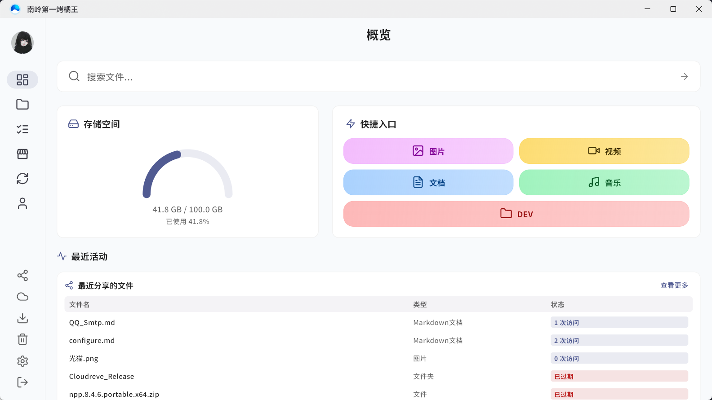
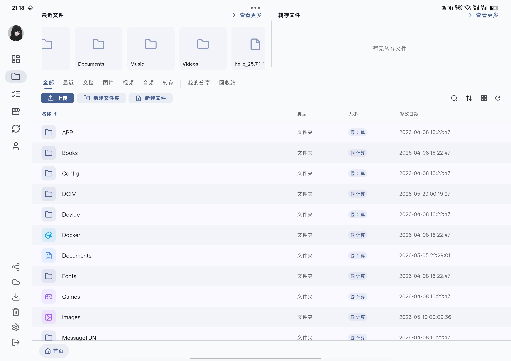
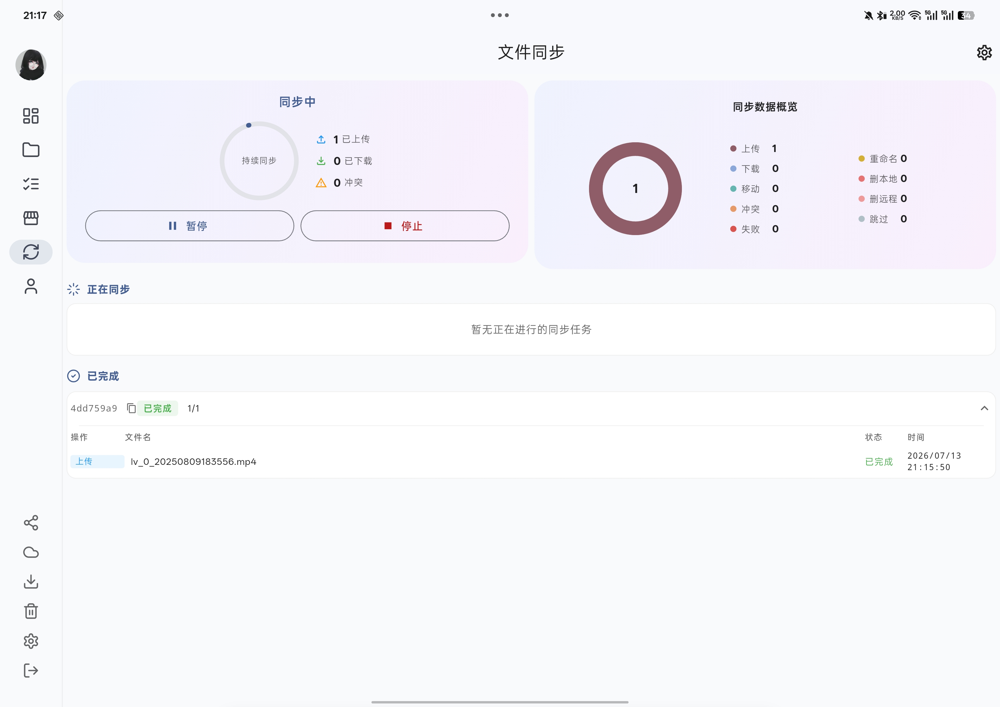
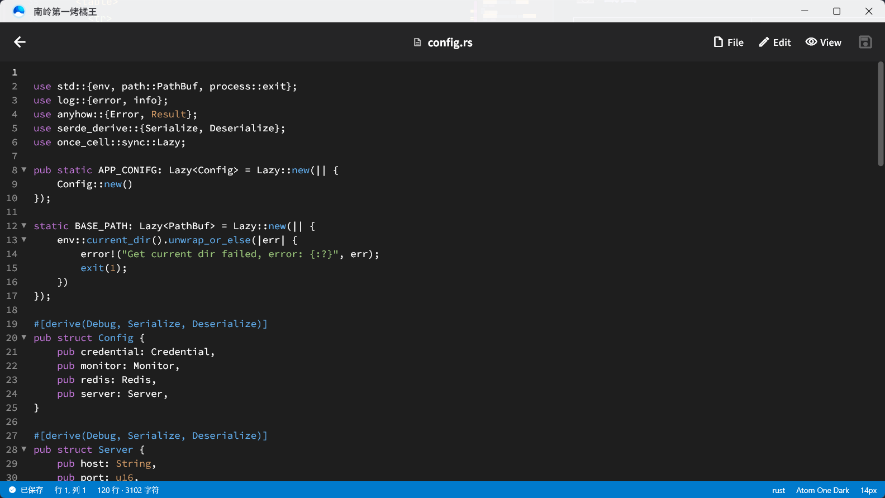
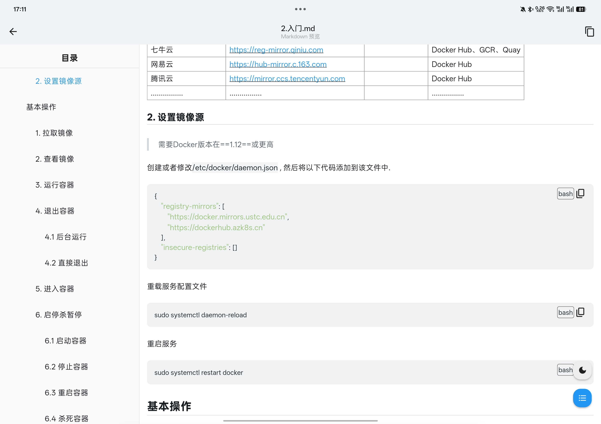
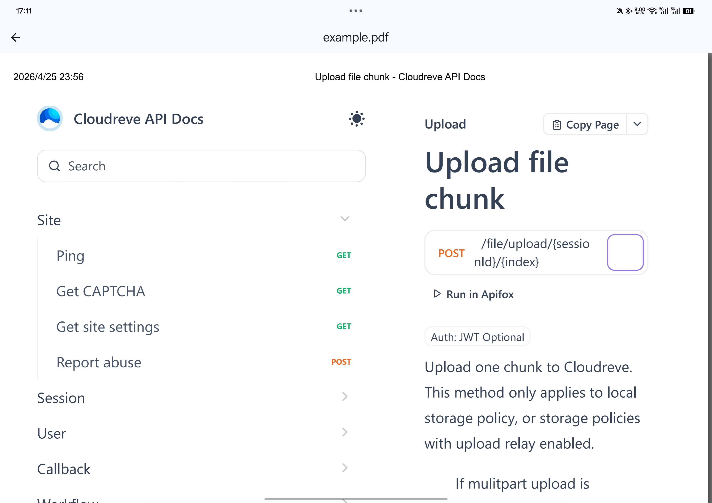
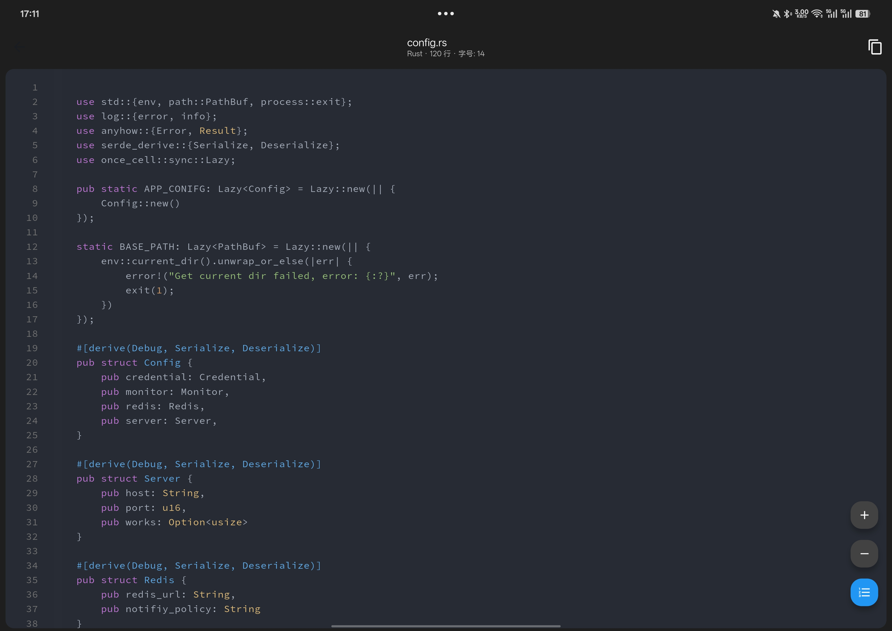
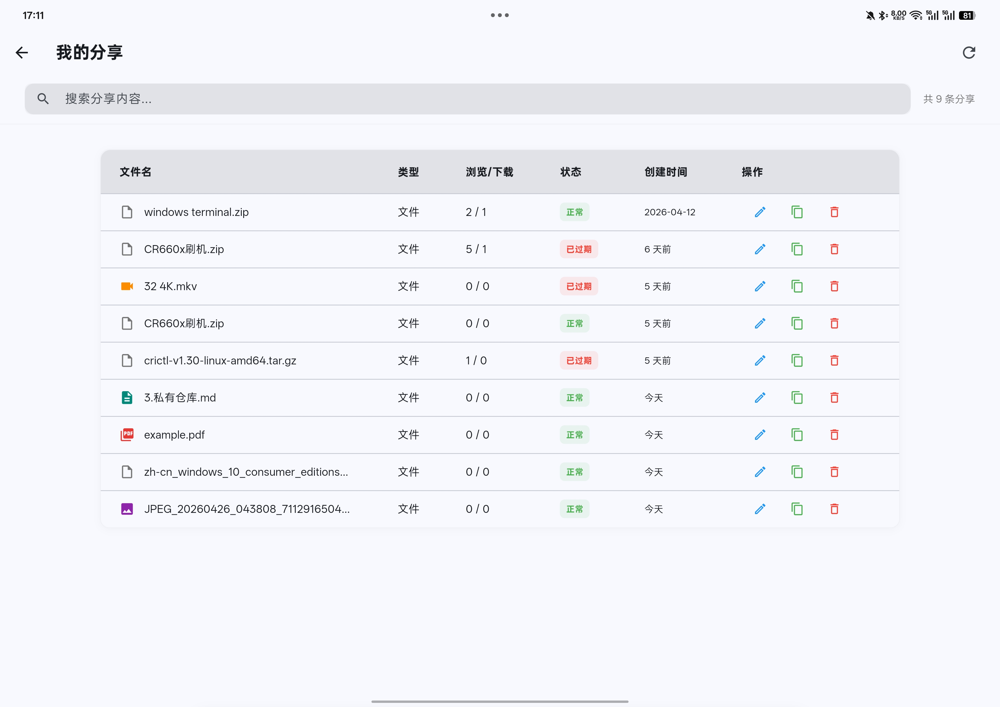
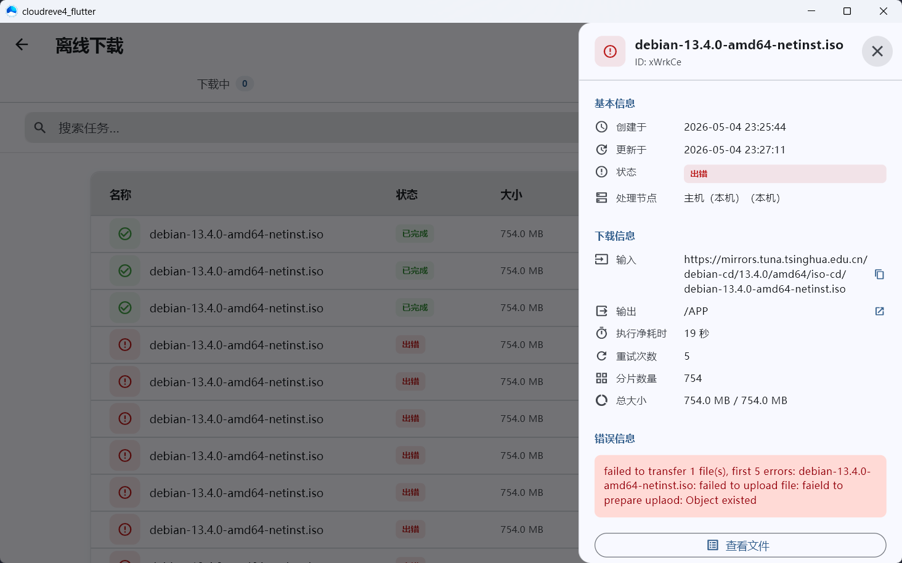

# Cloudreve4 Flutter

[](https://flutter.dev)
[](https://dart.dev)
[](https://www.rust-lang.org)
[](https://www.gnu.org/licenses/agpl-3.0)
[](./CHANGELOG_v1.4.0.md)

> 🚀 基于 Flutter + Rust 的 Cloudreve v4 全平台第三方客户端，提供网盘管理、媒体预览、双向同步等完整能力

---

## 📖 项目简介

Cloudreve4 Flutter 是一个面向 Cloudreve v4 后端的开源客户端，覆盖 **Android / Windows / Linux** 三端（Web 实验性支持）。除了完整对接 Cloudreve V4 的网盘管理能力，本项目内置了一个用 **Rust 编写的同步引擎** (`sync-core`)，实现真正可用的双向同步、Windows Cloud Filter 占位符、Linux FUSE 挂载等高级能力。

### ✨ 特性亮点

- 🦀 **Rust 同步引擎**：双向同步、SSE 实时事件、三路差异、冲突策略、带宽限速
- 🪟 **Windows Cloud Filter 镜像挂载**：占位符 + 按需水合，本地零空间占用
- 🐧 **Linux FUSE 读写挂载**：云端文件按需下载，本地写入自动上传
- 📱 **Android 相册自动备份**：DCIM/Camera 自动同步
- 🔐 **QR 码扫码登录**：X25519 + AES-GCM 加密中继 [**@mkw3627-ui**](https://github.com/mkw3627-ui)
- 🎬 **完整媒体预览**：图片 / PDF / 音视频 / Markdown / 代码（189 种语言高亮）
- 📂 **强大的文件管理**：分页加载、多字段排序、拖拽上传、键盘快捷键、面包屑导航
- 🎨 **现代化 Material 3 界面**：响应式布局，桌面端深度优化
- ⚡ **统一任务管理**：上传/下载任务 drift 持久化 + 分页加载，全平台 `background_downloader` 支持暂停 / 恢复 / 断点续传
- 🌐 **完整分享体系(服务端Pro)**：剪贴板自动检测、密码保护、跨域分享、批量转存
- 📦 **应用内自动更新**：Windows ZIP 覆盖更新 / Android APK 安装 `@mkw3627-ui 打包器支持, 兜底github`
- 🧩 **打包构建器**：站长专用, 适用于自定义构建, 品牌logo, 定制在线更新等一键打包, 请加入下方群组联系 `@mkw2233`
- 🧩 **数据迁移插件**：站长专用, 适用于站长下属用户一键迁移三方网盘数据, 请加入下方群组联系我
---

## 📸 截图

<table>
  <tr>
    <td align="center">
      <br/>
      <sub>概览</sub>
    </td>
    <td align="center">
      <br/>
      <sub>文件管理</sub>
    </td>
    <td align="center">
      <br/>
      <sub>同步引擎</sub>
    </td>
  </tr>
  <tr>
    <td align="center">
      <br/>
      <sub>文本编辑器</sub>
    </td>
    <td align="center">
      <br/>
      <sub>Markdown 预览</sub>
    </td>
    <td align="center">
      <br/>
      <sub>PDF 预览</sub>
    </td>
  </tr>
  <tr>
    <td align="center">
      <br/>
      <sub>代码预览</sub>
    </td>
    <td align="center">
      <br/>
      <sub>分享管理</sub>
    </td>
    <td align="center">
      <br/>
      <sub>离线下载</sub>
    </td>
  </tr>
</table>

## 🎬 视频演示

[]()

---

## 🛠️ 技术栈

| 组件 | 版本 |
|------|------|
| Flutter | 3.41.9 |
| Dart | 3.11.5 |
| Rust | 2021 edition |
| flutter_rust_bridge (FRB) | 最新 |
| 后端 API | Cloudreve v4.15+ |

**开发环境：**

```
Flutter 3.41.9 • channel stable
Tools • Dart 3.11.5 • DevTools 2.54.2
```

**构建环境：**

```
Android: compileSDK 36, targetSDK 36, minSDK 34
Windows: 11
Linux: Debian 13
```

**核心依赖：**

- 状态管理：`provider`
- 网络：`dio` + `http`
- 本地存储：`shared_preferences` + `hive` + `drift`（任务持久化）
- 文件下载：`background_downloader`（全平台统一）
- 媒体预览：`media_kit` (音视频, 基于 mpv) / `pdfrx` (PDF) / `photo_view` (图片) / `markdown_widget` (MD) / `code_text_field + flutter_highlight` (代码)
- WebView：`webview_flutter` (Android) + `flutter_inappwebview` (桌面)
- Rust 同步引擎：`tokio` / `tracing` / `notify-debouncer-full` / `reqwest` / `rusqlite` / `walkdir` / `windows` (CFApi) / `fuser` (FUSE) / `jni` (Android)

📚 [Cloudreve V4 API 文档](https://cloudrevev4.apifox.cn/)

---

## 📋 功能矩阵

### ✅ 基础功能

| 功能          | 状态 | 说明                                                 |
|-------------|------|----------------------------------------------------|
| 多服务器管理      | ✅ | 自由切换、增删改、URL 自动规范化                                 |
| 账号登录        | ✅ | Token 自动刷新、2FA、找回密码、注册                             |
| QR 码扫码登录    | ✅ | X25519 + AES-GCM 加密中继                              |
| Captcha 验证码 | ✅ | 全平台 WebView 接入（含 Turnstile）                        |
| 文件列表        | ✅ | 列表 / 网格双视图、分页加载、增量更新                               |
| 文件排序        | ✅ | 名称 / 大小 / 修改时间 / 创建时间，升降序，桌面端表头点击                  |
| 文件搜索        | ✅ | Ctrl+F 快捷键、实时搜索、搜索历史、防抖                            |
| 文件下载        | ✅ | `background_downloader` 全平台后台下载、断点续传、可暂停取消         |
| 文件夹打包下载     | ✅ | 异步打包状态展示，多选支持                                      |
| 文件上传        | ✅ | 分片上传、进度展示、桌面拖拽上传、悬浮窗、文件夹上传、暂停恢复断点续传、drift 持久化+分页加载 |
| 删除 / 重命名    | ✅ | 增量更新，不触发全量刷新                                       |
| 移动 / 复制     | ✅ | 批量、文件夹选择器对话框                                       |
| 我的分享        | ✅ | 创建 / 删除 / 管理 / 编辑、密码保护                             |
| 跨域分享        | ✅ | 自动识别同源/异源、剪贴板自动检测链接, 同源保存, 异源走离线下载                 |
| 回收站         | ✅ | 恢复 / 彻底删除                                          |
| WebDAV      | ✅ | 增删改查                                               |
| 离线下载        | ✅ | 依赖服务端 aria2                                        |
| 应用内更新       | ✅ | Windows ZIP 覆盖更新 / Android APK 安装                  |
| 缩略图         | ✅ | 网格懒加载                                              |
| 应用内手势       | ✅ | 右侧左滑返回上级                                           |
| 文本编辑器       | ✅ | 类vscode风格                                          |
| ...         | ✅ | ...                                                |

### 🦀 同步功能 (Rust sync-core)

| 同步模式 | 平台 | 说明 |
|---------|------|------|
| 全量同步 (Full) | 全平台 | 双向同步，6 种冲突策略 |
| 仅上传 (UploadOnly) | 全平台 | 本地 → 远程 |
| 仅下载 (DownloadOnly) | 全平台 | 远程 → 本地 |
| 镜像同步 (MirrorWcf) | Windows | CFApi 占位符 + 按需水合 |
| 镜像挂载 (FUSE) | Linux | FUSE 读写挂载 + 按需水合 |
| 相册同步 (AlbumUpload) | Android | DCIM/Camera 自动备份 |
| 相册同步 (AlbumDownload) | Android | 远程相册同步到本地 |

**冲突策略**：`keep_both` / `keep_local` / `keep_remote` / `newest_wins` / `largest_wins` / `manual`

**核心能力**：

- SSE 远程事件订阅 + notify 本地文件监听 + 500ms 防抖
- 三路差异算法（本地 vs 远程 vs DB）
- 分块上传/下载，Semaphore 并发控制 + 带宽限速
- 配置热更新（无需重启引擎）
- 同步状态/配置持久化，启动自动恢复
- 暂停 / 恢复 / 停止 / 强制重新同步 / 重置同步
- 日志级别热修改（Trace/Debug/Info/Warn/Error）

### 🎨 预览模块

| 类型 | 平台 | 说明 |
|------|------|------|
| 图片 | 全平台 | photo_view，Ctrl+滚轮缩放（桌面） |
| PDF | 全平台 | pdfrx，缩放/选中复制 |
| 音频 | 全平台 | media_kit (mpv)，流式播放、自定义 UI |
| 视频 | 全平台 | media_kit (mpv)，全屏、倍速、调音量 |
| 文本/代码 | 全平台 | 189 种语言高亮，SourceCodePro 等宽字体 |
| Markdown | 全平台 | github 风格，TOC，暗色模式 |

### ⚙️ 设置页面

| 模块 | 说明 |
|------|------|
| 个人资料 | 昵称 / 头像 |
| 安全设置 | 密码 / 2FA |
| 快捷入口 | 概览页快捷入口自定义 |
| 文件偏好 | 历史版本、视图同步、分享可见性 |
| 应用设置 | 深色模式 / 主题 / gravatar 镜像 / 下载设置 / 缓存 / 日志管理 |
| 同步设置 | 模式 / 冲突策略 / 并发数 / 带宽限制 / 远程目录选择 |
| 桌面系统设置 | 上传后关机、开机自启动 |

---

## 🚀 快速开始

### 环境要求

- **Flutter SDK** >= 3.41.9
- **Dart SDK** >= 3.11.5
- **Rust** 1.75+ (含 cargo)
- **Cloudreve v4** 后端服务
- Windows: Visual Studio 2022 + Windows 10 SDK
- Linux: Debian13及以上, 必须 `libfuse3-dev`、`libwebkit2gtk-4.1-dev`、`libwpewebkit-2.0-dev`（⚠️ 版本要求极新 >= 2.52.4-1）、`clang`、`cmake`、`ninja-build`、`pkg-config` 等
- Android: NDK r26+

### 安装依赖

```bash
flutter pub get
```

### 运行

```bash
flutter run
# 注意：pdfrx 和 media_kit 首次构建会从 GitHub 下载依赖，自行解决网络问题
# Rust sync-core 会通过 CMake 自动构建, Android需要手动构建
```

### 构建发布

```bash
# 一键构建（推荐）
./build.sh linux    # Linux deb 包
./build.sh apk      # Android APK（分架构）
./build.sh rs       # 仅构建 Android sync-core（所有 ABI 的 .so）
./build.sh all      # 同时构建

# 或手动
flutter build apk --release --split-per-abi      # Android
flutter build linux --release                    # Linux
flutter build windows --release                  # Windows
```

### Rust 引擎单独构建验证

```bash
cd native

# 验证各平台编译
cargo check -p sync-core                                         # 通用
cargo check -p sync-core --features windows-cfapi                # Windows
cargo check -p sync-core --features linux-notify,linux-fuse      # Linux notify, Linux FUSE
cargo check -p sync-core --features android-media                # Android

# FRB 代码生成（修改 ffi 后）
flutter_rust_bridge_codegen generate --config-file frb.yaml
```

---

## 📝 注意事项

- **媒体编解码**：音视频预览依赖 mpv，理论上 mpv 支持的格式均可播放, 但应该做好最基本的流媒体优化, 比如mp4容器的 moov, gop等
- **分片上传**：服务端要求按顺序上传分片，不支持并发, 性能受限, 服务端不建议超过100MB
- **Android 权限**：需 `POST_NOTIFICATIONS`（下载通知）+ `manageExternalStorage`（文件存储）
- **WCF 同步**：Windows 专属，本地零空间，删除模式可配置仅删本地或同步删远程
- **FUSE 挂载**：Linux 专属，本地写入会自动上传到云端 (需物理磁盘空间缓存)
- **同步日志**：输出到 `<应用数据目录>/sync_core/logs/` 和 stderr，可通过 UI 热修改级别

---

## 🤝 贡献

欢迎 PR / Issue。请按标准开源协作流程：

1. **Fork** 本仓库到你的账号下
2. 基于 `main` 创建特性分支：`git checkout -b feat/your-feature`
3. 开发并本地验证，提交前必须满足：
   - **Flutter 侧**：`flutter analyze` 输出零 `info` / `warn` / `error`
   - **Rust 侧**：所有 workspace 在所有 feature 组合下 `cargo clippy` 输出零 `info` / `warn` / `error`，例如：
   - 跨平台改动需在对应平台本地编译测试通过
4. 推送到你的 Fork 并发起 **Pull Request**，在 PR 描述中说明动机、改动范围、测试方式

**未通过上述检查的 PR 将被请求修改后再合并**。

---

## 📬 联系方式

- 📧 问题反馈：提交 Issue
- 💬 讨论交流：[Telegram 群组](https://t.me/+5WmnI6TkICgwZTc1)
- 🧩 站长打包器：如果你是站长, 有快捷定制构建需求, 请进入上方群组联系 `@mkw2233`

---

## 🌟 特别鸣谢

感谢 [**@mkw3627-ui**](https://github.com/mkw3627-ui) 对本项目的重要贡献—大量桌面端 UI 增强、QR 登录、悬浮窗、分享链接检测、Desktop文件管理器布局增强等均源自其 PR。

---

## 👏 捐赠 / 赞赏

如果这个项目为你带来帮助，请给一个 ⭐️ Star 支持或者也可以请作者喝杯奶茶！

| 支付宝 | 微信 |
| :---: | :---: |
|  |  |

---

## 📜 更新日志

- [**v1.4.0**](https://github.com/LimoYuan/cloudreve4_flutter/releases/tag/v1.4.0) - 2026-07-11 - Rust 同步引擎 / WCF / FUSE / QR 登录 / 桌面端增强 / 应用内更新 / 任务持久化 drift
- v1.3.0 - 移动端核心功能完整
- v1.2.1 - 早期版本
- ...

---

## ⚖️ 开源协议

本项目采用 **AGPL-3.0 (GNU Affero General Public License v3.0)** 协议。

### 核心约束

1. **传染性**：修改并重新发布必须以 AGPL-3.0 协议开源
2. **云端公开声明**：在服务器上运行并向公众提供网络服务时，必须向用户公开源代码（含修改）
3. **禁止闭源商业化**：未经授权，禁止将本项目代码闭源后作为商业产品销售, 否则将追究其法律责任

详见 [LICENSE](./LICENSE)。
